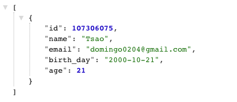

<h3>Spring boot starter</h3>

This is my first project to learn how to use **Java** `Spring Boot` to implement website backend API.
 

The source of the contents is from [Youtube Amigoscode](https://www.youtube.com/watch?v=9SGDpanrc8U&t=1221s)

 
<h4>1. My first Json result for `Student object`</h4>

